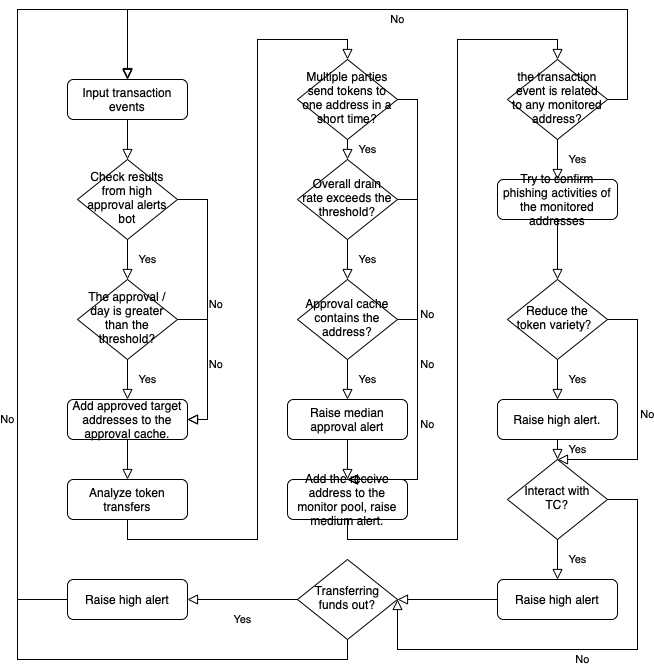

# Phishing Detect Agent

## Description

This agent detects phishing activities using on-chain data based on several key insights:
1. During phishing, tokens from different accounts are transferred to one account (the attacker's account) in a short time.
2. There is only one chance for the attacker, so in order to make more profit, tokens are nearly drained from victim accounts, resulting in an unusual high overall drain rate. For example, This [transaction](https://etherscan.io/tx/0xc27078f9c169f314e9909c58207e0e42ac5b550d7c5147fae0fb90ad8f7bfbb2) moves 0.019 ETH from the victim to the attacker, leaving the victim only 0.0001 ETH. During 2022 SUI Network Discord Hack incident, there are in total 39 transactions that transferred tokens to the [attacker's wallet](https://etherscan.io/address/0x8bCe2ECAE08D11a591b4196151212f0DFa63319f), 39 of which had nearly drained the respective token from the respective victim wallet, causing an overall drain rate of 100%.
3. When the attacker receive more than one kind of tokens, the attacker tends to firstly convert them into the same token before transferring out, resulting in the token variety reduction.
4. It is not very often that an EOA address receives tokens from multiple addresses in a short time (besides CEX's hot wallets, which can be tagged and skipped by setting `skipAddresses`).
5. When transferring out, attackers are likely to use money laundering protocols like TC or the disperse-then-aggregate strategy.
6. Attackers will not reveal their identities by transferring tokens to CEXs.
7. The transaction nonce of common victims will be greater than 0. This could help filter route accounts like this [one](https://etherscan.io/address/0x9c17ece8f79103bab818131102e9fd42589ee36a). Being said that, victims with nonce 0 are also possible ([example](https://etherscan.io/tx/0x9cc5b2df405a75225200a51b719ab08013659b13867f78ae4c4f4119dd839b87)). However, we argue that victims specially creating new wallets for unknown activities are not likely to be phished, and thus they are minority.

Note that although CEX's wallets usually have much higher volumes than normal EOAs, we argue that it **CANNOT** be used as a feature to identify attackers. For example this [attacker](https://etherscan.io/address/0x0016c0d0343e8f2c3a7b6a51606b84b1545ec606) has collected over 50,000 ETH over more than 100,000 transactions. Consequently, this agent does not have an effective way to distinguish between CEX's hot wallets and attackers for now (without using any third party APIs).

Based on the above 7 observations, the agent is developed. The workflow of the agent is illustrated as the following:

Additionally, this agent can:
1. Analyze transfers of native tokens, ERC20 tokens and ERC721 tokens.
2. Automatically skip distraction transactions, for example this [one](https://etherscan.io/tx/0x21c11ac42d96c4fe922c5fc05aab0e94b772263b7e92ce7d8dfe3ff1795607fe).
3. No external APIs are used, meaning this agent can be ran on any chain that Forta supports.
4. Extensive configurations.
5. Optimized number of RPC calls for maximum performance.

Note that to prevent re-invent the wheel, this agent uses `getAlert()` to fetch alerts from other agents and aggregate them into usable signals. Specifically two external agents are subscribed:
1. [`Money Laundering Tornado Cash`](https://explorer.forta.network/bot/0x4adff9a0ed29396d51ef3b16297070347aab25575f04a4e2bd62ec43ca4508d2): Fetch addresses that have interactions with TC, cross-referring them with local suspicious addresses to get confirmed phishing address.
2. [`Ice Phishing Detection 2.0`](https://explorer.forta.network/bot/0x8badbf2ad65abc3df5b1d9cc388e419d9255ef999fb69aac6bf395646cf01c14): Fetch large number of approvals, using them as prior information when processing token transfer events.

## Supported Chains

This agent is designed to be compatible with all chains for greater impact. No chain-specific APIs are used. So it supports all chains that Forta supports, both now and in the future.

## Configurations

In the first few lines of `src/agent.ts` there are many constants that can be tuned for possibly better performance:
1. `approvalThreshold` (default 5), used to filter alerts from bot `0x8badbf2ad65abc3df5b1d9cc388e419d9255ef999fb69aac6bf395646cf01c14`. Only target addresses that have been granted with more than `approvalThreshold` approvals will be recorded.
2. `phishingWindow` (default 12 * 3600), 12 hours.
3. `drainThreshold` (default 0.8), if 80% of the balance is transferred, it is likely to form a drain attack.
4. `numTransferThreshold` (default 5), if there are more than 5 transfers in `phishingWindow` from different addresses, the drain rate can be then calculated.
5. `drainRateThreshold` (default 0.8), if 80% of the transactions of an address is defined as a drain attack, it is likely to be a phishing attack.
6. `numLegitTransactions` (default 2000), if the sent number of transactions of an account is greater than this value, it is considered to be legit (e.g. CEX wallets).
7. `approvalCheck` (default false), additional check approvals. Enable this will slow down the agent.
8. `assertAttackersAlwaysUseEOA` (default true), assume attacker addresses are all EOA. This is a common assumption. However, you can turn it off and this bot would still work, but the false positive would be probably higher considering many contracts have very similar activities compared to phishing attackers,e.g. NFT Mint, Bootstrap, FOMO.
9. `skipAddresses`, a list of addresses that is considered legit and will be skipped for checking. For example, the genesis address (`0x00000000000000000000000000000000000000000`).

## Alerts

Describe each of the type of alerts fired by this agent

- POSSIBLE-PHISHING-ACTIVITIES-EOA
  - Fired when an EOA address received many tokens from different addresses in a short time.
  - Severity is always set to "medium".
  - Type is always set to "suspicious".
  - phishingAddress: the target address.
  - transactionHash: the transaction hash of the transaction that triggered the alert.

- POSSIBLE-PHISHING-ACTIVITIES
  - Fired when an address is possible to be a phishing address, considering both approval, number of distinct interacted addresses and overall drain rate.
  - Severity is always set to "medium".
  - Type is always set to "suspicious".
  - phishingAddress: the target address.
  - transactionHash: the transaction hash of the transaction that triggered the alert.

- CONFIRMED-PHISHING-ACTIVITIES
  - Fired when a possible phishing address is confirmed to be a phishing address, by gathering more evidences like token variety reduction or TC interaction.
  - Severity is always set to "high".
  - Type is always set to "suspicious".
  - phishingAddress: the target address.
  - transactionHash: the transaction hash of the transaction that triggered the alert.

## Test Data

Two real world phishing incidents are tested in the `agent.spec.ts`:

* 2022 SUI Network Discord Hack incident (category: privacy keys leaked to the attacker, all valued tokens are drained): https://etherscan.io/address/0x8bCe2ECAE08D11a591b4196151212f0DFa63319f
* 2022 Badger DAO incident (category: approval granted to the attacker, approved tokens are drained): https://etherscan.io/address/0x1fcdb04d0c5364fbd92c73ca8af9baa72c269107
* 2022 Project Galaxy Discord Hack incident (category: fake NFT minting website, looks legit, funds are **NOT** drained): https://etherscan.io/address/0x8a8fa36b68df2eb9762b053303380992fdbdf7ed

You can run the test by running `npm run test` (will run for several minutes, and requires archive node RPC), if all tests pass then the agent is ready to go.
